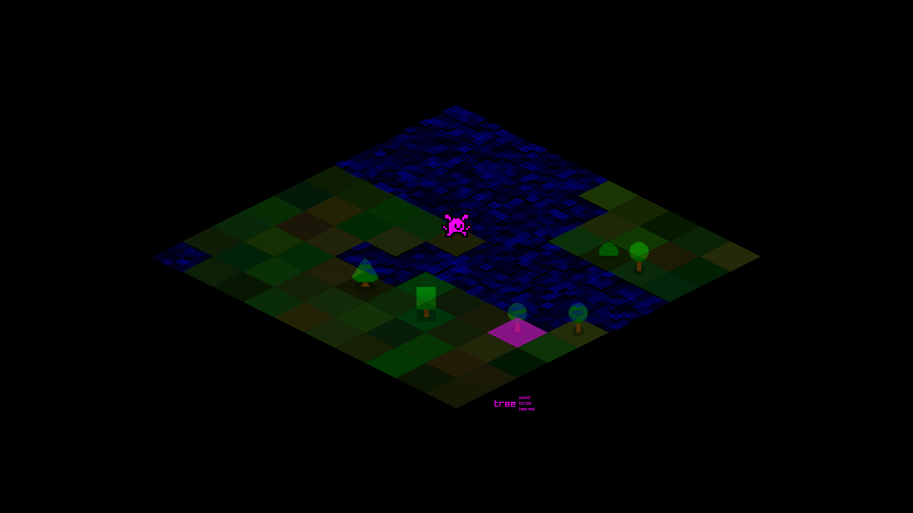
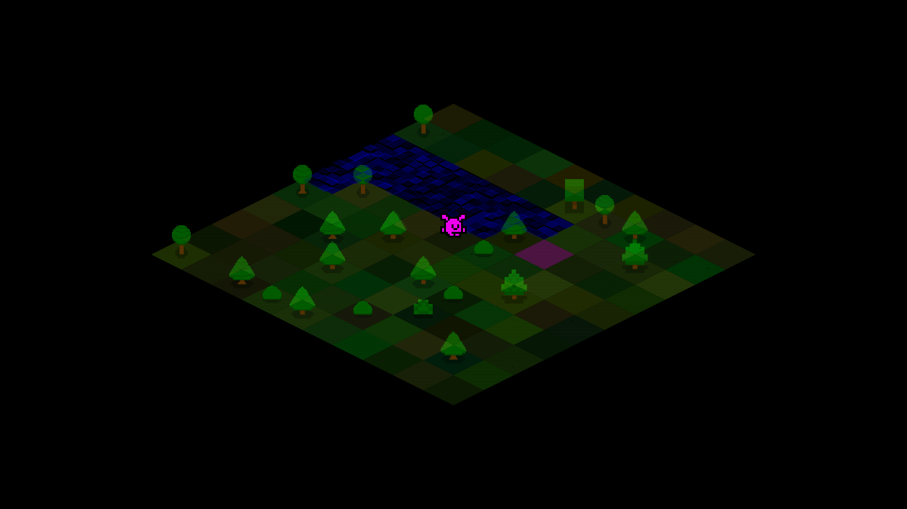

# fake3d_iso_layout
A fake 3d / isometric tile landscape with water - view on Youtiube https://www.youtube.com/watch?v=0CEyULy1wrw
  
&bull; Mouse - Click a block to move (not correctly implemented, needs work)
 
&bull; END Key - Closes the window
 
&bull; DELETE key - Debug menu
  

  

  
